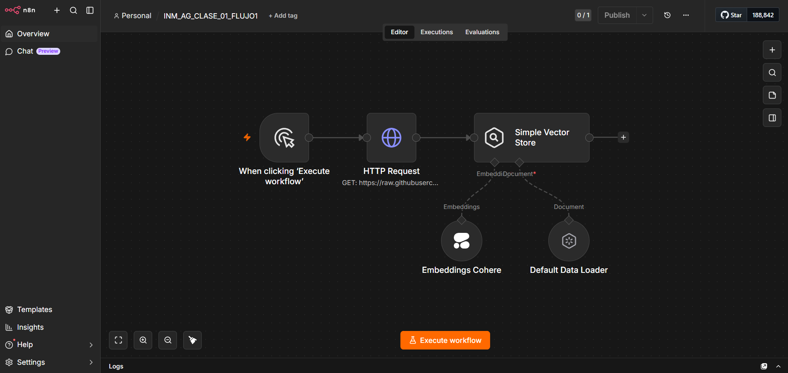
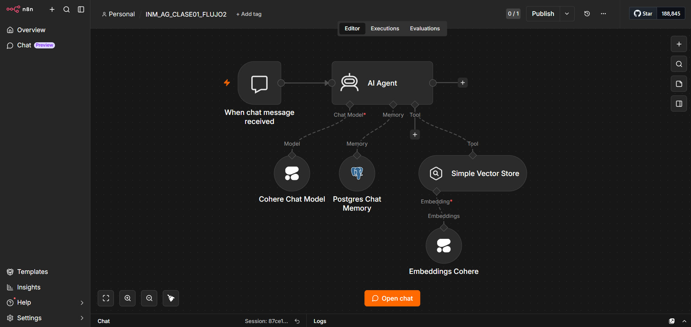

# 🤖 ChocolaTECH HR AI Agent - Clase01

Asistente inteligente para RRHH desarrollado con n8n, Cohere, PostgreSQL y arquitectura RAG.

---

# 🚀 Características

- 💬 Agente conversacional IA
- 🔎 Búsqueda semántica de políticas RRHH
- 🧠 Memoria conversacional persistente
- 📚 Arquitectura RAG
- ⚡ Automatización de atención a empleados
- 🏢 Asistente empresarial para RRHH

---

# 🛠️ Tecnologías Utilizadas

- ⚙️ n8n
- 🧠 Cohere
- 🐘 PostgreSQL
- ☁️ Railway
- 📦 Vector Store
- 🔍 Embeddings
- 🤖 AI Agent
- 📚 Arquitectura RAG

---

# 🔄 Workflows

## 📥 Workflow 1 — Ingesta de Conocimiento RRHH

Procesa documentación del área de RRHH para convertirla en embeddings semánticos utilizables por IA.

### Incluye

- 📄 Procesamiento documental
- 🔎 Indexación semántica
- 🧠 Generación de embeddings
- 📚 Base de conocimiento vectorial

---

## 💬 Workflow 2 — Agente Conversacional RRHH

Gestiona consultas de empleados utilizando recuperación semántica y memoria conversacional.

### Incluye

- 🤖 Agente IA
- 🧠 Modelo Conversacional Cohere
- 💾 Memoria Conversacional PostgreSQL
- 🔎 Recuperación Vectorial
- 📚 Consulta de Base de Conocimiento

---

# 📸 Screenshots

## 📥 Workflow 1 — Ingesta de Conocimiento RRHH



---

## 💬 Workflow 2 — Agente Conversacional RRHH



---

# 🏗️ Arquitectura

Este proyecto implementa:

## 📚 Retrieval-Augmented Generation (RAG)

combinado con:

- 🧠 Memoria Conversacional
- 🔎 Búsqueda Semántica
- ⚡ Automatización IA
- ☁️ Infraestructura Cloud

---

# 📂 Estructura del Proyecto

```bash
chocolatech-hr-ai-agent-Clase01/
│
├── workflows/
├── docs/
├── screenshots/
├── README.md
└── .gitignore
```

---

# 🎯 Objetivos

- Automatizar soporte RRHH
- Mejorar atención a empleados
- Centralizar conocimiento corporativo
- Reducir consultas repetitivas
- Implementar búsqueda semántica inteligente

---

# 📚 Documentación Técnica

La documentación técnica detallada se encuentra en:

```bash
docs/
```

Incluye:

- Arquitectura RAG
- Explicación de workflows
- Stack tecnológico
- Flujo completo del sistema

---

# 👨‍💻 Autor

Daniel A.

---

# ⭐ Futuras Mejoras

- 🌐 Interfaz web
- 🔐 Sistema de autenticación
- 📊 Dashboard analítico
- 🐳 Dockerización
- 🔄 Pipeline CI/CD
- 📱 Integración WhatsApp
- 🧾 Soporte multi-departamento

---

# 🏢 Caso de Uso

El sistema fue diseñado para automatizar consultas internas del área de RRHH mediante inteligencia artificial conversacional, utilizando recuperación semántica de documentación corporativa y memoria persistente para mantener contexto entre interacciones.

---

# 📌 Arquitectura General

```text
Empleado
   ↓
Agente IA RRHH
   ↓
Recuperación Semántica
   ↓
Base Vectorial RRHH
   ↓
Políticas y Documentación
```